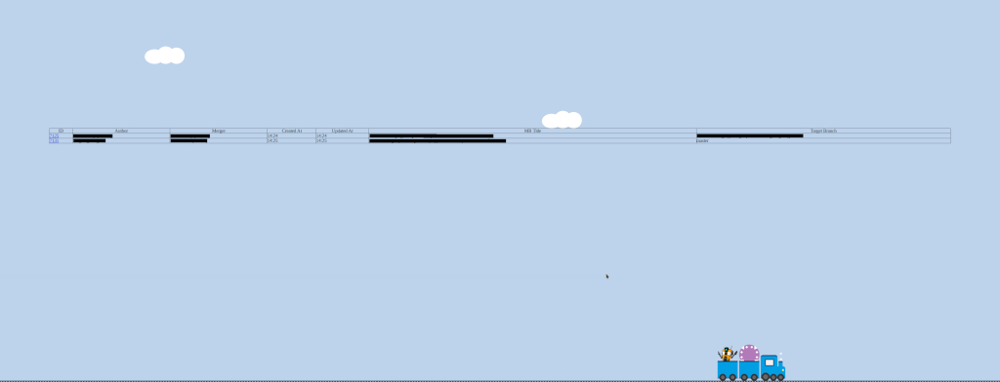

# Merge Train Status Web Application

This web application displays the status of active merge trains for a specific project hosted on a GitLab instance. It fetches data from the GitLab API and presents it in a user-friendly format.



## Features

- Displays a table of active merge trains with details such as ID, Author, Merger, Created At, Updated At, MR Title, and Target Branch.
- Visual representation of the merge train with avatars of the authors.
- Auto-refreshes every 3 minutes to keep the data up-to-date.

## Prerequisites

- A GitLab instance with an active project.
- A valid GitLab private token with API access.

## Setup

1. Clone the repository to your local machine:
    ```sh
    git clone <repository-url></repository-url>
    ```

2. Navigate to the project directory:
    ```sh
    cd /<path>/merge-train-web
    ```

3. Open the `status.html` file in a text editor and replace the placeholders with your actual values:
    ```html
    const PRIVATE_TOKEN = "<YOUR_PRIVATE_TOKEN>";
    const PROJECT_ID = "<YOUR_PROJECT_ID>";
    const HOST_URL = "<YOUR_HOST_URL>";
    ```

4. Ensure you have the required CSS files in the `css` directory:
    - `reset.min.css`
    - `style.css`

5. Ensure you have the favicon in the `img` directory:
    - `favicon.ico`

## Usage

1. Open the `status.html` file in a web browser.
2. The page will automatically fetch and display the active merge trains.
3. The page will refresh every 3 minutes to update the data.

## Customization

- You can adjust the refresh interval by modifying the `content` attribute of the meta tag in the `<head>` section:
    ```html
    <meta http-equiv="refresh" content="180">
    ```

- You can customize the appearance by editing the `style.css` file.

## License

This project is licensed under the MIT License. See the [LICENSE](LICENSE) file for details.

## Contributing

Contributions are welcome! Please open an issue or submit a pull request for any improvements or bug fixes.

## Acknowledgements

- [GitLab API](https://docs.gitlab.com/ee/api/)
- [HTML](https://developer.mozilla.org/en-US/docs/Web/HTML)
- [CSS](https://developer.mozilla.org/en-US/docs/Web/CSS)
- [JavaScript](https://developer.mozilla.org/en-US/docs/Web/JavaScript)